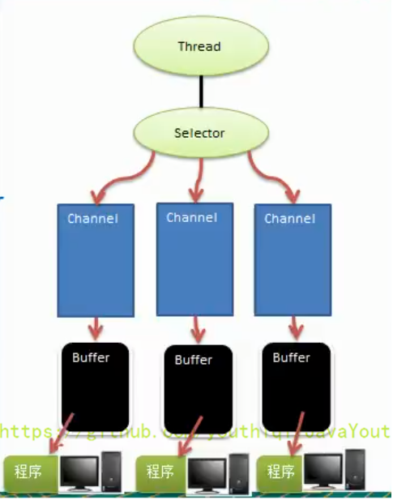
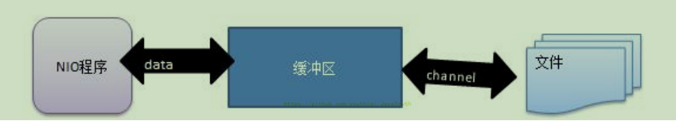

<h1>NIO 三大核心原理示意图 </h1>
一张图描述 NIO 的 Selector、Channel 和 Buffer 的关系。

Selector、Channel 和 Buffer 关系图（简单版） 关系图的说明:

1.每个 Channel 都会对应一个 Buffer。 
2.Selector 对应一个线程，一个线程对应多个 Channel（连接）。 
3.该图反应了有三个 Channel 注册到该 Selector //程序 
4.程序切换到哪个 Channel 是由事件决定的，Event 就是一个重要的概念。 
5.Selector 会根据不同的事件，在各个通道上切换。 
6.Buffer 就是一个内存块，底层是有一个数组。 
7.数据的读取写入是通过 Buffer，这个和 BIO是不同的，BIO 中要么是输入流，或者是输出流，不能双向，但是 NIO 的 Buffer 是可以读也可以写，需要 flip 方法切换 Channel
是双向的，可以返回底层操作系统的情况，比如 Linux，底层的操作系统通道就是双向的。 

<h1>缓冲区（Buffer）</h1>
<h2>基本介绍</h2>
缓冲区（Buffer）：缓冲区本质上是一个可以读写数据的内存块，可以理解成是一个容器对象（含数组），该对象提供了一组方法，可以更轻松地使用内存块，，缓冲区对象内置了一些机制，能够跟踪和记录缓冲区的状态变化情况。Channel 提供从文件、网络读取数据的渠道，但是读取或写入的数据都必须经由 Buffer，如图:【后面举例说明】 

